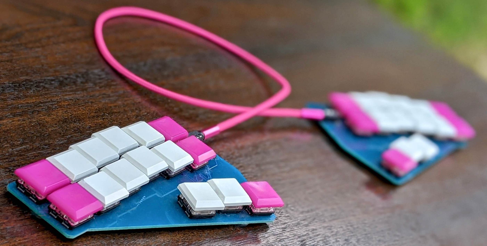

---
meta:
  - name: description
    content: How do stenographers and court reporters type 3 times faster than normal typists? Learn their secrets in under 10 minutes with this straightforward explanation.
exampleSentence: Every great dream begins with a dreamer. Always remember, you have within you the strength, the patience, and the passion to reach for the stars to change the world.
exampleChords: EFR GRAET DREEM GINS W AI DREEM *ER TP-PL AULS RER KW-BG U V W-N U -T STREN KW-BG -T PAISH ENS KW-BG SKP-T PASHN TO REECH F-RT STARS TO KHAING -T WORLD TP-PL
---

# How Steno Works

I'm a programmer who uses stenography in my everyday work. Coworkers often come to my desk to chat or ask questions, not knowing that I use a steno machine to program and type. As I start typing in front of them, they'll watch as words and symbols appear in bursts, faster than they've ever seen anyone type before. Then, confused, they'll look down at my hands to see how I can possibly move that fast and see the reduced keyboard layout that I'm typing on, which always leads to more questions.

A steno machine only needs twenty-three keys, while normal keyboards have about a hundred. I wish I could capture everyone's face the first time they see a steno machine in action—that expression of shock and bewilderment.

When I first heard about stenography, I was amazed: stories of court reporters keeping up with multiple speakers in a courtroom, typing at a certified speed of 225 words per minute, faster than most people talk at 180 words per minute. Was that even possible? Did their school just teach them to type more quickly? Well, not quite.

Stenography is one of those things that's hard to understand just by watching, and even if I tell you the basics, it's a skill that takes months or years to learn. Just as someone can show you how hitting keys on a piano makes sounds, it will take a while before you understand the notes enough to play music or compose pieces of your own.

I'm going to break down, as best I can, the biggest differences between a keyboard and a stenography machine and try to demonstrate how steno can be so much faster.

## In a Nutshell

On a normal keyboard, a typist hits **individual keys to express individual letters** as fast as possible to spell words. A stenographer, on the other hand, uses a steno machine to make "chords" by hitting multiple keys. Chords, much like the ones played on a piano, express sounds instead of letters and allow the stenographer to type at a slower rate to achieve the same word count, because those **chords can express entire words and phrases.** The result is about **three times faster** than traditional typing.

A stenography setup consists of a steno machine and steno software running on a computer.^[Before computers existed, stenographers wrote to "paper tape" which only captured which keys were hit on the machine. After transcribing, the stenographer would have to go back and convert their "notes" into text, very much like pen shorthand. Nowadays, translation from key press to text is instant.] The machine can either be specially made for steno, or just an ordinary keyboard that supports n-key rollover (hitting all the keys at once.) The software that is most commonly used by amateurs is [Plover](https://www.openstenoproject.org/plover/), which listens to what you do on the steno machine and then outputs keystrokes to whatever program you're using.

## Key Concepts

Steno is completely different from traditional typing. Ordinary keyboards are very simple to use: you learn where the letters are, how to make things uppercase, and how to type symbols. Getting faster is a matter of hand positioning and practice.

Stenography takes months to learn and years to master. Let's look at some of the key concepts that make stenography special.

### Chords

The steno machine's compressed layout is used to form _chords_, which loosely correspond to _syllables_.^[The reason I keep saying "syllables, loosely" is that the text representation of a chord is often unpronounceable. For example, `N-L` for "until" has no vowel; `SDAOIN` for "design" has an unpronounceable `SD`; and the chord to backspace the previous chord is just the `*` key which can't be pronounced.] Steno feels a lot like playing a piano, and stenographers map between "steno speak" and "the English language."

::: tip
When I say the word _chord_, you can imagine _syllable._
:::

Take a look at the steno layout in all its glory:

<Steno-Display stroke="" labels="all" />

Obviously, **a steno machine looks very different from a normal keyboard.** There are so few keys (no "N" key), repeated keys (a "T" key on each side), and vowels at the bottom. Let's look at how this weird layout can be used to type really, _really_ fast.

If a stenographer wants to type "cat", they sound it out. Different key combinations create different "sounds", so they **press down all of the following keys**:

<Steno-Display stroke="KAT" labels="all" />

Upon release, the keys are read from left-to-right (with vowels in the middle, splitting the two halves of the keyboard around the `*` key) to produce the syllable `KAT` which outputs the word "cat".

### Missing Letters

Because there are so few (and repeated!) letters on the base stenography layout, missing letters are created using combinations of other keys. For example, no word starts with the letters `HR`, so we can safely use the combination of keys `HR` to express a different sound. `HR` is used to represent `L` by convention.

To type a word starting with an "L" sound, the stenographer hits the keys `HR`. See if you can guess what word this is:

<Steno-Display stroke="LAF" labels="all" />

Upon release, the keys are read left-to-right to produce the syllable `LAF` which outputs the word "laugh".

### Repeated keys

The reason that there are repeated keys on the layout is:

- The **left side of the keyboard** <Steno-Thumb stroke="STKPWHR" /> is dedicated to the **beginning of the syllable.**
- The **right side of the keyboard** <Steno-Thumb stroke="-FRPBLGTSDZ" /> is dedicated to the **end of the syllable.**
- In between we have the vowels keys <Steno-Thumb stroke="AOEU" />.

A good example of where using the left or right half of the keyboard matters can be seen by comparing how we chord the word "start"…

<Steno-Display stroke="START" labels="all" />

…and how we chord the word "strat" (abbreviation for _strategy_):

<Steno-Display stroke="STRAT" labels="all" />

If you're having trouble spotting the difference, it's simply pressing the `R` key that's on either side of the layout. The left R represents the R at the beginning of a syllable (like in "rough" or "trap") and the right R represents the R at the end of a syllable (like "car" or "tarp.")

### Spelling

Because chords are roughly syllables, writing in stenography feels more like speaking than spelling.

In steno, all these words with **different spellings** are chorded with the **same right-side keys** because they all end with a similar sound:

- `OSHN` → <Steno-Thumb stroke="OSHN" /> → ocean
- `MOSHN` → <Steno-Thumb stroke="MOSHN" /> → motion
- `FASHN` → <Steno-Thumb stroke="FASHN" /> → fashion
- `VISHN` → <Steno-Thumb stroke="VISHN" /> → vision
- `MISHN` → <Steno-Thumb stroke="MISHN" /> → mission
- `RUSHN` → <Steno-Thumb stroke="RUSHN" /> → Russian

**Multisyllable words** are chorded by stringing together **multiple chords**: `RE` plus `WARD` becomes "reward".

Spelling is less of a problem because words just get sounded out:

- `LA MA` → llama
- `FA SIL TAIT` → facilitate
- `WENS DAI` → Wednesday
- `BA RA KU DA` → barracuda

To distinguish between homophones, the stenographer uses different vowel keys or adds in the "asterisk" key, `*`, which is kind of like a wildcard:

- `BAIR` → bare
- `BAER` → bear
- `MAIN` → main
- `MA*IN` → Maine

### Briefs

Ever watched a professor save time by writing "w" instead of "with"? Have you ever written "brb" in a text chat instead of "be right back"? This concept is used extensively in stenography: a **brief (short for abbreviation)** is a shortcut to save time.^[The natural extension of abbreviating written words is pen stenography, or written shorthand. Written shorthand is very similar to machine stenography in that you use a phonetic representation of sounds instead of spelling out words. However, written shorthand is a little slower (150WPM) and requires transcribing your shorthand notes to convert them back to longhand.]

Single-key chords like `W` and `U` map to "with" and "you", respectively. There are also briefs for very long words, so the chord for "particular" is a syllable that sounds like `PLAR`; "remember" is `RER`; "government" is `GOFMT`.

### Customizable Dictionary

In the steno software, there's a giant "dictionary" that maps between chords like `LA MA` and words like "llama." To write the entire English language, a stenographer's dictionary is often made up of over 100,000 entries. Don't worry, the stenographer doesn't need to memorize every single entry! Once they know how to sound-out words from syllables, they should be able to write any word they encounter.

**The dictionary is customizable**. As the English language develops and new words are created, the stenographer can add them to their dictionary. This is critical for anyone writing jargon, complex terminology, or programming languages.

Every stenographer has their own personal dictionary where they can add their own entries. If one stenographer were to try another stenographer's machine, the words would probably come out wrong because every dictionary is unique.^[The reason that stenographers end up with very personalized dictionaries is because even though we often learn a pretty similar "theory", we build up our own habits and preferences. To read more about theories, see [Theories and Dictionaries](/introduction/theories-and-dictionaries.html).]

### Prefixes, suffixes, and root words

Compound words can be strung together thanks to a phonetic system of prefixes and suffixes. "Uncomfortable" could be written as "un" (prefix `UN`) + "comfort" (root word `KOFRT`) + "able" (suffix `-BL`). "Antidisestablishmentarianism" could be composed from the prefixes "anti" and "dis"; the root word "establish"; and the suffixes "ment", "arian", and "ism".^[Just because we _could_ compose "antidisestablishmentarianism" from prefixes and suffixes (`A*INT DIS STAEB *MT A*IRN *IFM`) doesn't mean we would. It's a great word to have a brief for in order to save _a lot_ of time (1 stroke instead of 6). In Plover, the brief for antidisestablishmentarianism is `SLA*IRM` which is pretty arbritary as far as briefs go. Another long single-stroke brief in Plover is `SFRAJ` → supercalifragilisticexpialidocious.]

Finally, if a word isn't composable from prefixes, suffixes, and root words and the stenographer doesn't have that word in their dictionary, they can fall back to one-letter-per-chord, which is called _fingerspelling_.^[Fingerspelling is a slow fallback option, only about 50 words per minute for a professional. To fingerspell "stop" the stenographer would stroke `S*` <Steno-Thumb stroke="S*" /> then `T*` <Steno-Thumb stroke="T*" /> then `O*` <Steno-Thumb stroke="O*" /> then `P*` <Steno-Thumb stroke="P*" />.]

### Automatic capitalization and spacing

Another way that stenographers save time is by not needing to capitalize and space apart words themselves. For the most part, the steno software knows that if you end a sentence with a period, the next word will be capitalized. It knows that "Los Angeles" and "Tom" always have capital letters. Of course, there are ways to get around this behavior. For example, there is a chord that forces the next word to come out lowercase, regardless of whether it's a proper noun or not.

### Typos

When someone makes a typo in stenography, it's not a misplaced letter, it's a misplaced sound.

It can make for some pretty comical mistakes.

When typing "ground" on a normal keyboard, you might accidentally type "gronud" (swapping u and n), but a stenographer might accidentally write "frowned"! The only difference is the stenographer accidentally used an "f" sound instead of a "g" sound.

Another mistake is an accidental key in a chord. This could turn "remember" (`RER`) into "rear" (`RAER`.)

Using the wrong sound can have devastating consequences: [one time](https://twitter.com/morinted/status/1232396116962029576), I tried to chord `HER TAJ` for "heritage" but I hit `HER TIJ` and got "her to the best of my knowledge."

If the stenographer types a chord that isn't in their dictionary, say `ST-RB`, then the output will be "ST-RB" so that they can see their mistake.^[Typos in stenography are referred to as *misstrokes*. Stenographers often save recurring misstrokes so that repeated mistakes come out properly. For example, I often mistakenly think that the word "relevant" is "revelant". I set my machine so that when I chord `REV LANT`, it outputs "relevant."]

Luckily, fixing a typo is as simple as tapping the `*` key to erase the last chord.

### Symbols

You might think that it's hard to input symbols if everything is sound-based. But the opposite is true! Stenographers can create complex sequences of symbols, keyboard shortcuts, movement keys, and emoji through chords.

There is a plugin for Plover where it converts the last word you wrote into an emoji. My "convert-to-emoji" stroke is `MOEJ`. So `KAT MOEJ` → 🐈

One strategy that is used for symbols is to omit vowels from the root word. When there are no vowels and no asterisk in a steno chord, that's shown with a dash (`-`).

- `BRAIS` → brace
- `BR-S` → {
- `BR*S` → }

It's possible to create briefs for multiple symbols at once. For example, `SHR*UG` maps to `¯\_(ツ)_/¯` in my dictionary.

There are also strategies for arrow keys, keyboard shortcuts, and everything else you might usually use a keyboard for.

## Interactive Example

You can play with the following example to see **a quote from Harriet Tubman written by a stenographer at different speeds.**

<Demo-Paragraph />

Notice that words and chords don't all map one-to-one.

Chords can be as little as individual letters or syllables as we **sound out** a word:

- `DREEM ER` → dreamer
- `PAISH ENS` → patience

There are **shortcuts (briefs)** to get longer words:

- `W` → with
- `RER` → remember

Sometimes, a single chord maps to a **phrase**:

- `SKP-T` → and the
- `F-RT` → for the

Some chords are based on their **shape** on the keyboard and have nothing to do with sounds:

- `TP-PL` → <Steno-Thumb stroke="TP-PL" /> → . (period)
- `KW-BG` → <Steno-Thumb stroke="KW-BG" /> → , (comma)
- `SKP` → <Steno-Thumb stroke="SKP" /> → and
  - This chord is used because it's all the way on the left side of the keyboard. This allows it to be combined with other keys to make phrases like "and the" (see above.)

Rather than typing {{ $frontmatter.exampleSentence.length }} characters, the stenographer made {{ $frontmatter.exampleChords.split(' ').length }} chords to write this quote. Given that a professional stenographer can make chords around 3.5 times per second, that would mean it would take around **{{ Math.round($frontmatter.exampleChords.split(' ').length / 3.5) }} seconds** to write.

The average typist, typing 60 words per minute or 5 characters per second, would take about **{{ Math.round($frontmatter.exampleSentence.length / 5) }} seconds.**

Our stenographer in this scenario clocks in at **{{ Math.round($frontmatter.exampleSentence.length / 5 * 60 / ($frontmatter.exampleChords.split(' ').length / 3.5)) }} words per minute**, making them {{
  (
    $frontmatter.exampleSentence.length / 5 /
    ($frontmatter.exampleChords.split(' ').length / 3.5)
  ).toFixed(1)
}} times faster!

## Where it's used

Machine stenography was originally developed in the late 1800s for taking down spoken word, but has evolved to be used as a general keyboard replacement.

It is used professionally in courtrooms, and as an accessibility tool for realtime captioning and transcription. A certified court reporter in the United States must be able to write 225 words per minute. Human speech averages around 180 words per minute. Most people type around 60 words per minute, but there are [exceptional typists](https://seanwrona.com/typing.php) who can type upwards of 150 words per minute.

Court reporting courses usually last at least 2 years and require 225 words per minute to graduate. They are full-time programs and are very intense.

But stenography is used in an amateur fashion by hobbyists, writers, programmers, and office workers.^[See the variety of uses that learners have in the [Open Steno Project community survey](http://plover.stenoknight.com/2020/03/corrected-survey-responses-link.html)] It can completely replace normal keyboard usage. For self-taught stenographers, it usually takes six months to a year of casual learning to match their normal typing speed. Getting faster on top of that comes with practice.

## Summary

Hopefully now you have a better understanding of how steno works and why it's so fast. Steno uses chording to multiply the power of a smaller number of keys than a normal keyboard. A chord on a steno machine can be represented by a syllable-like sound and it can map to words, letters, symbols, phrases, and more. Learning how to use stenography to type starts with understanding how to use those "syllables" to create chords.

Even though making chords on a steno machine is slower (around 3-4 chords a second) than a typist on a keyboard (around 5-10 keys a second), by focusing on sounds rather than letters, a stenographer gets more out of each chord and comes out on top.

**This book, as part of the [Open Steno Project](http://www.openstenoproject.org/), aims to bring the art of stenography—the art of speaking through your fingers, _The Art of Chording_—to everyone.**

::: tip
If you're fascinated with how steno works and you want to learn more, **you're in the right place!** This website is a free, open source textbook that aims to teach steno to anyone and everyone. The Open Steno Project tries to keep software and learning materials free, while supporting the development of affordable hardware options. [Download Plover today](https://github.com/openstenoproject/plover/releases) and learn how to use it by moving on to the next lesson.
:::
