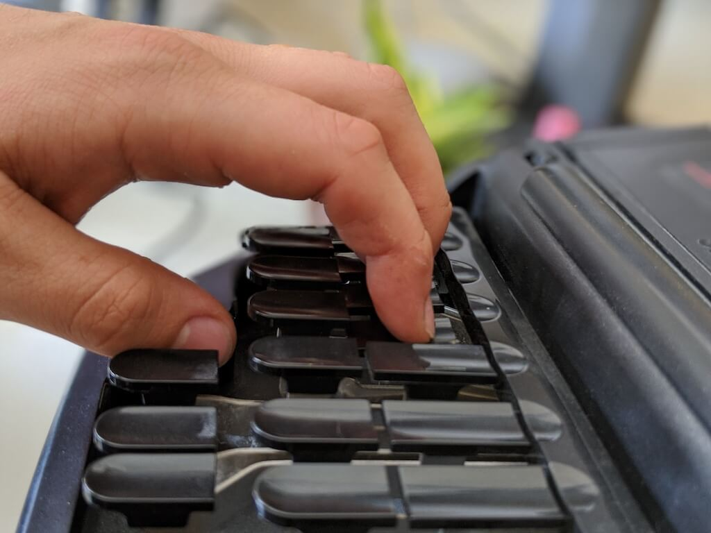
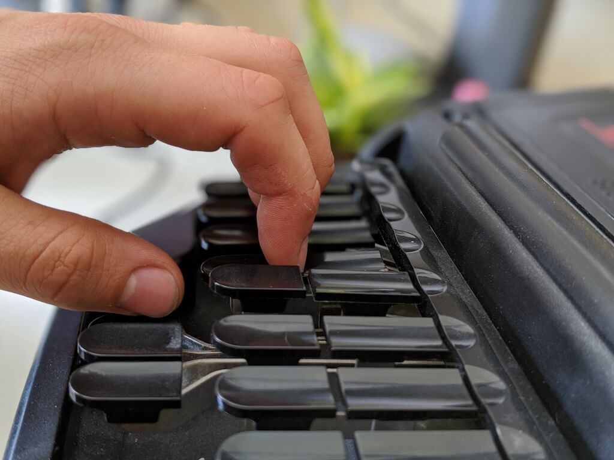

# Chorded Keyboard

Stenography uses a chorded keyboard. **On a chorded keyboard, you hit multiple keys at once**, instead of one at a time. A chord is only registered when you release all the keys. **The order that you press them down in doesn't matter**, only _which_ keys you hit is important.

---

Hopefully you've read [How Steno Works](/introduction/how-steno-works) from the introduction, so you're familiar with this weird layout:

<Steno-Display labels="all" stroke="-" />

I'll repeat some of the oddities of the layout:

- Missing keys: no "i" key, no "n", no shift, seemingly no punctuation.
- Repeated keys: two S's, T's, P's, and R's.

While strange and foreign, this really low number of keys is just about perfect for our ten fingers, which is part of what makes stenography so fast and ergonomic.

Everything that's missing from the base layout is made up from combinations of other keys. Not only that, but the names of the keys don't represent _letters_, they represent _sounds_.

If you hit the `U` key, the result is not the letter "u", like on a typing keyboard, it is the full word "you". More on that later!

There are multiples of some keys because, at its core, the **steno layout makes syllables**. A syllable, like "tot", can have the same consonant at the beginning and the end. In the same way, the steno keyboard has a "T" on the left side and one on the right side.

::: definition Chord
A chord is a set of keys that are hit down at the same time. A chord can be made up of only one key, or as many as the whole keyboard layout!
:::

## Home Row

On a keyboard, the home row position is where your fingers are supposed to rest in between typing words. Steno machines also have a home row.

The home row for stenography is between the cracks for each set of keys:

<Steno-Display labels="all" stroke="-" fingers />

The stenographer will usually hover their hand, barely touching the keys, curling their fingers like so:


To strike the top row, you move your fingers up:

<Steno-Display labels="all" stroke="TPHA" fingers />



To strike the bottom row, you move your fingers down:

<Steno-Display labels="all" stroke="KWRO" fingers />


To hit an entire column or set of vowel keys, you press down on the cracks between the keys:

<Steno-Display labels="all" stroke="TKPWHRAO" fingers />



By shifting our fingers, it's technically possible to hit every key on the layout at once:

<Steno-Display labels="all" stroke="STKPWHRAO*EUFRPBLGTSDZ" fingers />

### Finger Position

Each finger is responsible for just two keys, except:

- The left pinky which only has one: `S` <Steno-Thumb stroke="S" />
- The right index which has three: `*`, `-F`, `-R` <Steno-Thumb stroke="*FR" />
- The right pinky which has four: `-T`, `-S`, `-D`, `-Z` <Steno-Thumb stroke="-TSDZ" />

Of note, some users use the left index finger to hit `*`. It is a matter of personal preference. It is okay to use either or both hands.

**Fingers never change rows.** Keys are always hit with the same fingers.

**Left-hand keys and fingers:**

- `S` <Steno-Thumb stroke="S" /> left pinky
- `T` and `K` <Steno-Thumb stroke="TK" /> left ring finger
- `P` and `W` <Steno-Thumb stroke="PW" /> left middle finger
- `H` and `R` <Steno-Thumb stroke="HR" /> left index finger
- `A` and `O` <Steno-Thumb stroke="AO" /> left thumb finger

**Right-hand keys and fingers:**

- `E` and `U` <Steno-Thumb stroke="EU" /> right thumb finger
- `F` and `R` <Steno-Thumb stroke="-FR" /> right index finger
- `L` and `G` <Steno-Thumb stroke="-LG" /> right middle finger
- `T`, `S`, `D`, and `Z` <Steno-Thumb stroke="-TSDZ" /> right ring finger
- `S` <Steno-Thumb stroke="S" /> right pinky

The asterisk <Steno-Thumb stroke="*" /> is traditionally pressed with the right-hand index finger, but you could press it with the left-hand index finger or a combination of both.

### Backspacing

Instead of backspacing letter-by-letter, stenography backspaces one chord at a time. To "undo" the last stroke, simply press the `*` key \(the asterisk key\).

## Key-side matters

Steno keys are always processed in the same order. They are read from left-to-right, top-to-bottom, with the vowel keys in the middle.

The **left-hand side gives us the starting sounds** \(onset,\) the **center gives us the vowel sounds**, and the **right-hand side gives us the ending sounds** \(coda.\)

See the following chord:

<Steno-Display stroke="KAT" labels="all" />

This is always interpreted as `KAT`, the stroke for "cat."

If you wanted to write "AKT", you would not use these keys. **The order is fixed.**

The side of the keyboard matters. Notice the difference between `RAT`…

<Steno-Display stroke="RAT" labels="all" />

…and `ART`:

<Steno-Display stroke="ART" labels="all" />

The only difference is which `R` key was hit.

## Steno Order

Hitting all the keys on the machine at once would result in this chord: `#STKPWHRAO*EUFRPBLGTSDZ`

We call this "steno order"—simply put, the order that steno keys will always be interpreted in by your steno software.

::: definition Steno order
The order that steno keys will always be interpreted in by your steno software. All chords are in steno order.
:::

Every single chord on a steno machine can be represented as a subset of steno order.

Take `KAT` from earlier, we're just picking out those three keys from the full order:

```
#STKPWHRAO*EUFRPBLGTSDZ
   K    A          T
```

For this reason, it's impossible to have a chord that's not in steno order. Notice that there's no `AKT` so it's impossible to chord `AKT`.

Most stenographers will memorize steno order, either in study or as a consequence of reading raw steno notes. For now, you can refer back to this lesson while you are still learning. If you are ever on your machine and want to know steno order, just mash every key then release, and steno order will pop out!

## Practice

For now, you can move on to the next lessons in order to start writing your first words.

As an exercise, it is worth memorizing steno order, as well as trying to draw out the full keyboard layout from memory. This is especially helpful if you've already learned how to write some words so that you can learn the positions of the keys with your hands and not just your mind.

`#STKPWHRAO*EUFRPBLGTSDZ`
